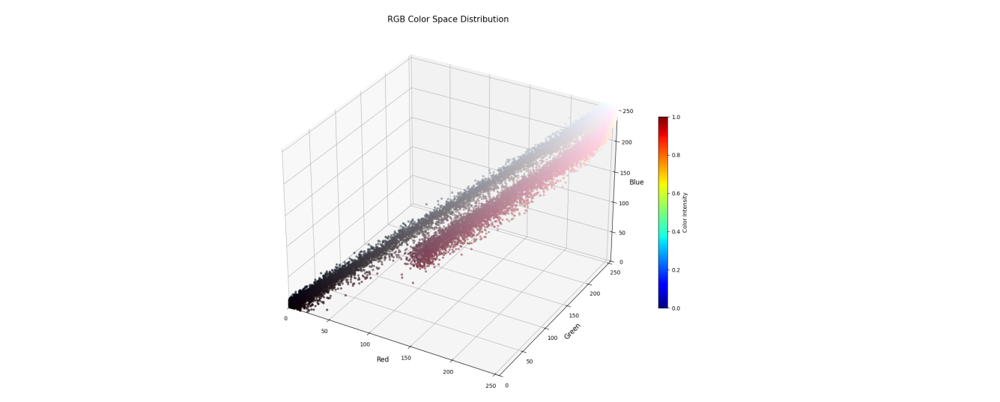
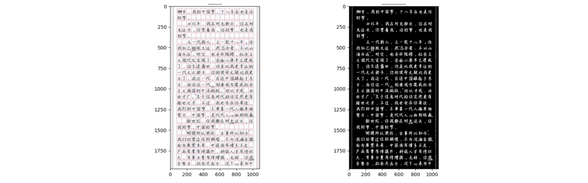
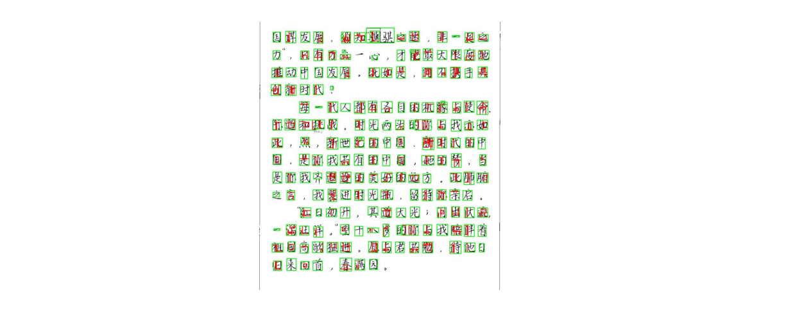
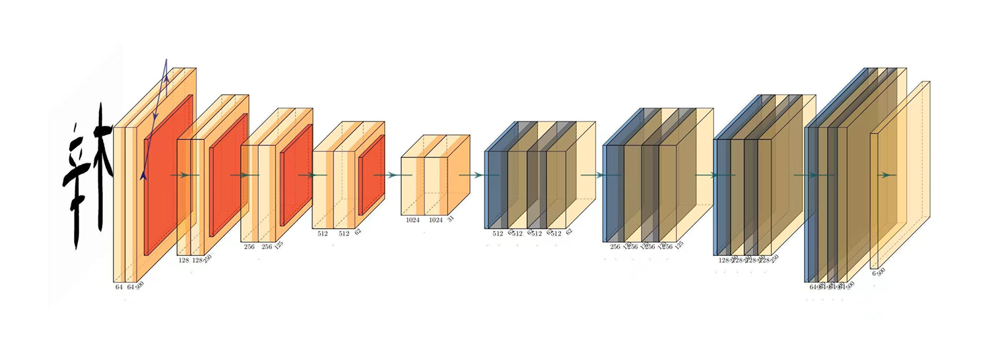
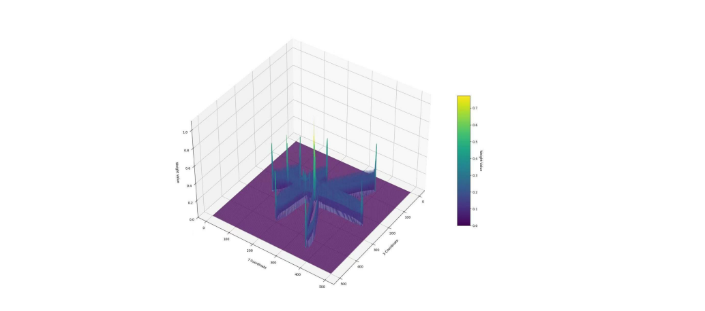
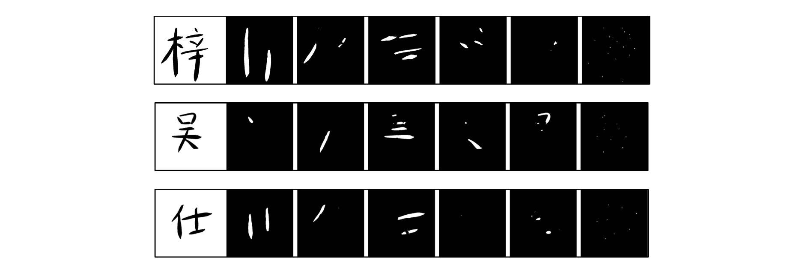

# CharDetect_-_Divide

这是一个用于手写文字图像处理的深度学习项目，主要功能包括文字提取、笔画分割和图像风格转换。本项目基于 UNet 网络结构进行训练，并结合 Flask 框架和Next.js实现了一个简单的 Web 应用。

---

## 📁 项目目录结构

```
CharDetect_&_Divide/
├── src/                  # 核心代码模块
│   ├── model/              # 模型定义（UNet）
│   ├── tools/              # 工具函数（KMeans 过滤器、图像调整等）
│   ├── Detecter.py         # 文字检测模块
│   ├── Divider.py          # 笔画分割模块
│   ├── StyleTansform.py    # 风格迁移与增强模块
│   └── __init__.py
├── train/                # 训练相关代码
│   ├── data/               # 数据集工具和预处理脚本
│   └── src/                # 模型训练逻辑
│        └── main.py        # 主训练脚本
├── front/                # 前端界面
├── paper/                # 研究报告
├── app.py                # Flask 后端服务入口
├── install.py            # Python 依赖安装脚本
├── requirements.txt      # Python 依赖要求
└── README.md             # 项目说明文档
```


---

## 🔧 功能模块介绍

### 1. `Divider.py` - 笔画分割模块
- 使用训练好的 UNet 模型对输入图像进行像素级语义分割。
- 支持将图像分割为多个类别（如5类笔画+关键点）。
- 输出每个类别的二值掩码图像。

### 2. [Detecter.py](file://C:\Users\Lenovo\PycharmProjects\CharDetect_&_Divide\src\Detecter.py) - 文字检测模块
- 通过K-means聚类及OpenCV方法实现了文字区域的提取与定位。





- 支持从复杂背景中提取出文字区域并进行裁剪。



- 可配合 `tools` 中的 [resize.py](file://C:\Users\Lenovo\PycharmProjects\CharDetect_&_Divide\src\tools\resize.py) 调整输出尺寸。

### 3. [StyleTansform.py](file://C:\Users\Lenovo\PycharmProjects\CharDetect_&_Divide\src\StyleTansform.py) - 风格迁移模块
- 提供图像风格增强功能（如对比度增强、边缘锐化等）。
- 支持多种风格选项，可通过 API 参数指定。

### 4. `Flask App` - Web 后端服务
- 提供 `/api/detect` 和 `/api/divide` 接口用于调用图像处理流程。

---

## 🧪 模型训练

模型使用 PyTorch 构建，基于 UNet 结构，并在训练过程中引入了注意力机制（SE Block）和加权交叉熵损失函数。

### 模型组件
- **UNet**: 主干网络，支持双线性插值或转置卷积上采样，在本项目中，我们设置了4层下采样及4层上采样。



- **SEBlock**: 注意力机制模块，提升特征表达能力。
- **WeightedBCEWithLogitsLoss**: 自定义损失函数，考虑不同类别权重不平衡问题。



### 数据集
- 我们构建了一个flutter应用，用于收集带拆分笔画的手写数据集（由于主要实现方式并未涉及过多图像处理原理，故代码未展示到本仓库中）
- 目前已收集近500张的小规模数据集，包含400个标准字及60个随机字

### 训练方式
- 使用 Adam 优化器 + ReduceLROnPlateau 学习率调度器。
- 在Apple Silicon(M3 pro)平台训练24轮

### 训练效果

- 目前，模型对笔画较为简单的字体已经能够有较好的拟合效果



---

## 📄 研究报告及项目创新点

- 请前往paper目录下查看

## 📦 依赖安装

**1. Python依赖**

```bash
python install.py
```


> 推荐使用虚拟环境（venv 或 conda）管理依赖。

**2. Node依赖**

```bash
cd front
npm install
```


> 如安装过慢，请切换到国内源

---

## ▶️ 运行项目

### 启动后端服务

```bash
cd CharDetect_&_Divide
python app.py
```


服务默认运行在 `http://localhost:5000`

### 启动前端服务

```bash
cd CharDetect_&_Divide/front
npm run dev
```

浏览器输入`http://localhost:3000`


---

## 📌 使用示例（API）

### 示例请求（POST）

#### `/api/detect`
```json
{
  "image": "<file>",
  "width": "256",
  "height": "256",
  "style": "enhance"
}
```


#### `/api/divide`
```json
{
  "image": "<file>",
  "width": "256",
  "height": "256"
}
```


响应格式：
```json
{
  "processed_images": [
    "data:image/png;base64,...",
    ...
  ]
}
```


---

## 🧩 后期计划

- 将数据集扩展到1200张训练后通过半监督学习进行数据集扩充
- 使用GAN生成第五类笔画，在UNet模型输出中抛弃第五类笔画（复杂笔画），减轻UNet的拟合难度

---

如有任何问题或建议，请提交 issue 或联系作者。欢迎贡献代码！
